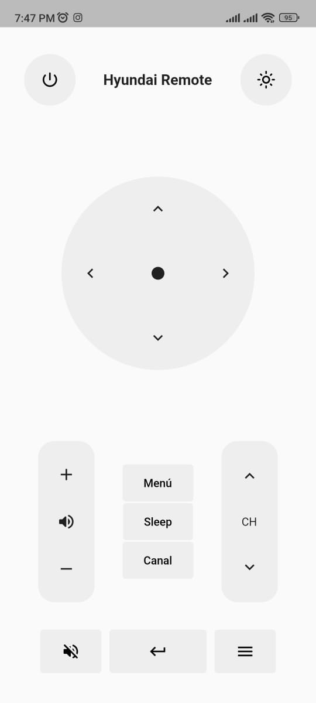

# Control de TV Flutter

Aplicación para interactuar con el sensor de infrarrojos del dispositivo y darle un uso de control remoto.

**Importante:** Esta versión del control remoto solo es compatible con los modelos de TV de la marca Hyundai.


[](https://flutter.dev/)

## Features

- [x]  Encender y apagar la TV
- [x]  Cambiar el canal hacia arriba o hacia abajo
- [x]  Ajustar el volumen hacia arriba o hacia abajo
- [x]  Control de funciones adicionales, como menú, retroceso y silencio
- [x]  Distintos temas

## Screenshots


## Packages uses

Package | Usage
------------ | -------------
[vibration](https://pub.dev/packages/vibration) | Este paquete se usa principalmente para dar una retroalimentación tactial al usuario despues de pulsar un botón.
[ir_sensor](https://pub.dev/packages/ir_sensor) | Se utiliza para enviar los codigos correspondientes de cada botón

## Building from Source

1. Asegúrate de tener Flutter instalado en tu sistema. Si no lo tienes, sigue las instrucciones de instalación de Flutter en la [documentación oficial de Flutter](https://flutter.dev/docs/get-started/install).

2. Clona este repositorio en tu máquina local:

   ```shell
   git clone https://github.com/leiderCastillo/ControlHyundaiTV.git
   ```
3. Ejecuta la aplicación con Android Studio o VS Code. O desde la línea de comandos:
   ```bash
   flutter pub get
   flutter run
   ```

## Contribute
las contribuciones son bienvenidas

## Contact
GitHub [@leiderCastillo](https://github.com/leiderCastillo/)
